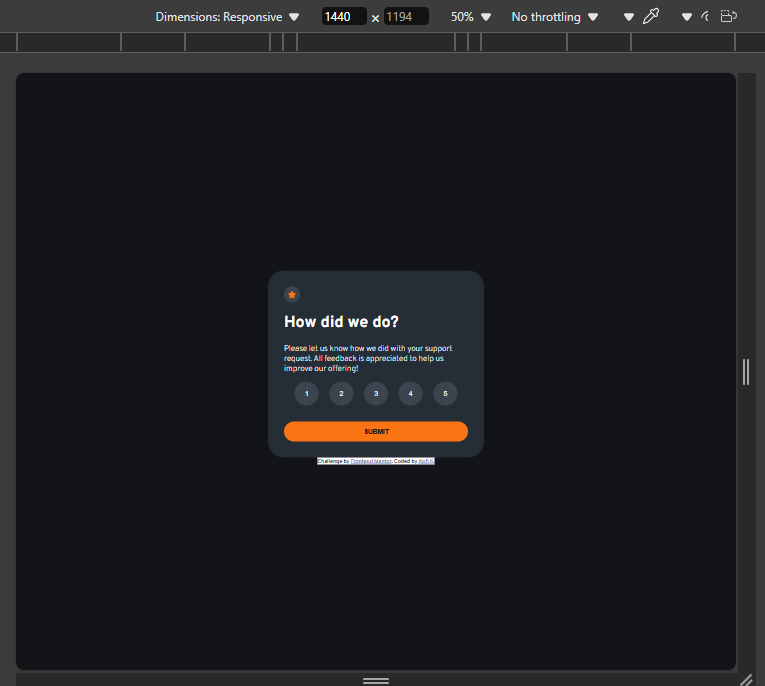
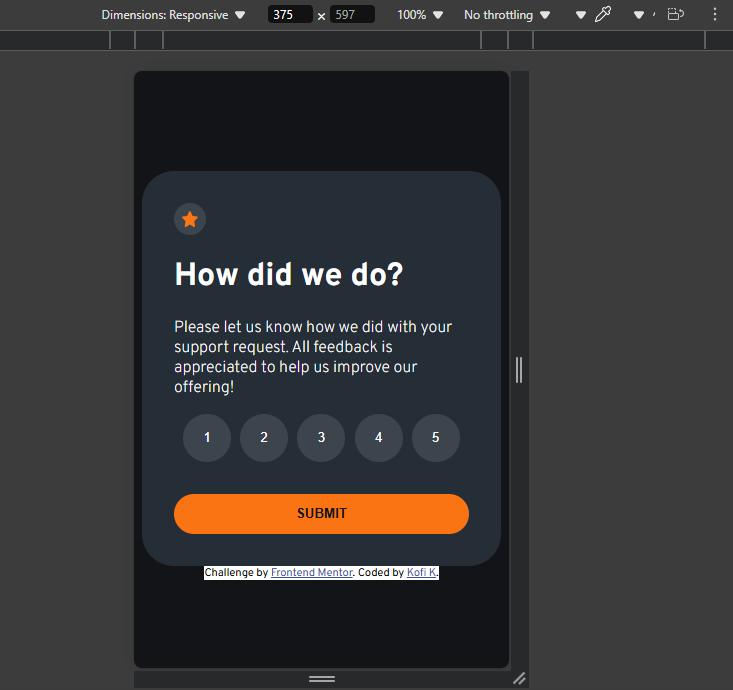
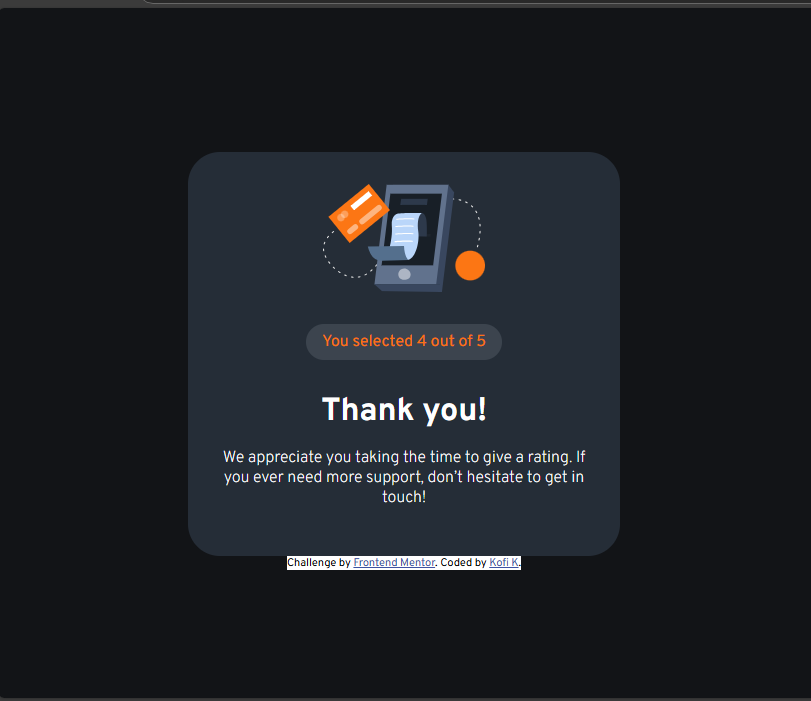
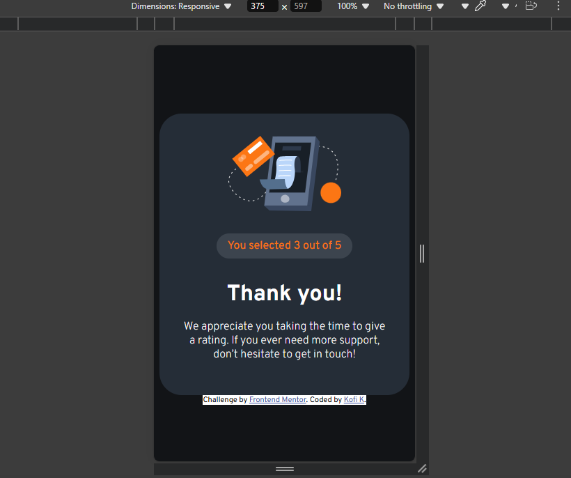
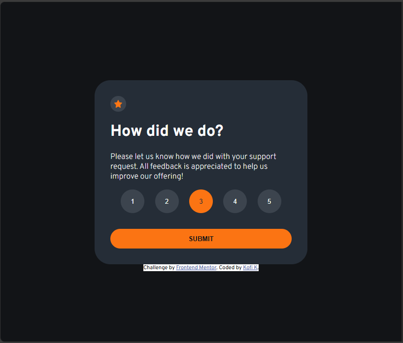
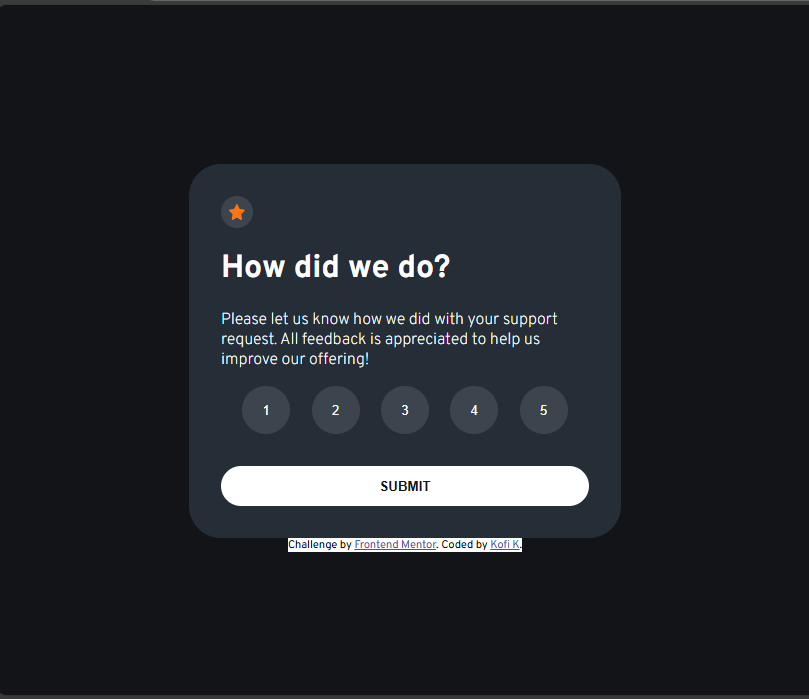

# Frontend Mentor - Interactive rating component solution

This is a solution to the [Interactive rating component challenge on Frontend Mentor](https://www.frontendmentor.io/challenges/interactive-rating-component-koxpeBUmI). Frontend Mentor challenges help you improve your coding skills by building realistic projects. 

## Table of contents

- [Overview](#overview)
  - [The challenge](#the-challenge)
  - [Screenshot](#screenshot)
  - [Links](#links)
- [My process](#my-process)
  - [Built with](#built-with)
  - [What I learned](#what-i-learned)
  - [Continued development](#continued-development)
  - [Useful resources](#useful-resources)
- [Author](#author)
- [Acknowledgments](#acknowledgments)

**Note: Delete this note and update the table of contents based on what sections you keep.**

## Overview

### The challenge

Users should be able to:

- View the optimal layout for the app depending on their device's screen size
- See hover states for all interactive elements on the page
- Select and submit a number rating
- See the "Thank you" card state after submitting a rating

### Screenshot



Desktop View



Mobile View



Thank You Card Desktop Mode



Thank You Card Mobile Mode



Active State Screenshot 1


Active State Screenshot 2
### Links

- Solution URL: [Add solution URL here](https://your-solution-url.com)
- Live Site URL: [https://kofi100.github.io/RatingWebsiteHTMLProject/](https://kofi100.github.io/RatingWebsiteHTMLProject/)

## My process

### Built with

- Semantic HTML5 markup
- CSS custom properties
- Flexbox
- JavaScript

### What I learned

I recapped my knowing of changing the transparency of a color by making a new variable and also 
tried to recap my knowledge of JS in order to assign a variable the Ratign thru the innerHTML of the
button selected.
It was nice.

To see how you can add code snippets, see below:

```html

```
```css

```
```js

```

### Continued development

 I want to focus on JS to assign variables and save such variables on devices or a file to be used later.

 So far,it's been good.

### Useful resources

- [Example resource 1](https://www.example.com) - This helped me for XYZ reason. I really liked this pattern and will use it going forward.
- [Example resource 2](https://www.example.com) - This is an amazing article which helped me finally understand XYZ. I'd recommend it to anyone still learning this concept.

**Note: Delete this note and replace the list above with resources that helped you during the challenge. These could come in handy for anyone viewing your solution or for yourself when you look back on this project in the future.**

## Author

- Website - [GitHub](https://github.com/Kofi100/)
- Frontend Mentor - [@Kofi100](https://www.frontendmentor.io/profile/Kofi100)
<!-- - Twitter - [@yourusername](https://www.twitter.com/yourusername) -->

<!-- ## Acknowledgments

This is where you can give a hat tip to anyone who helped you out on this project. Perhaps you worked in a team or got some inspiration from someone else's solution. This is the perfect place to give them some credit.

**Note: Delete this note and edit this section's content as necessary. If you completed this challenge by yourself, feel free to delete this section entirely.** -->
